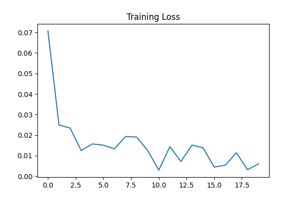
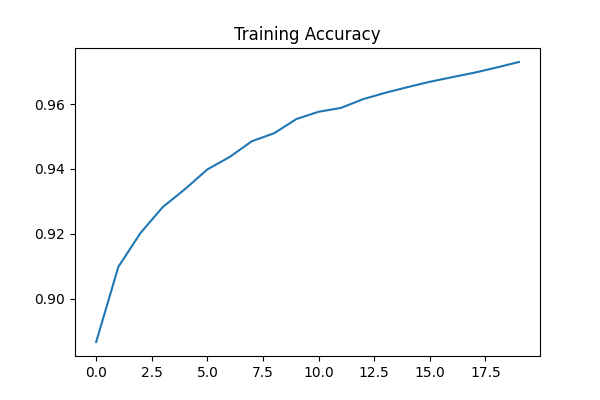
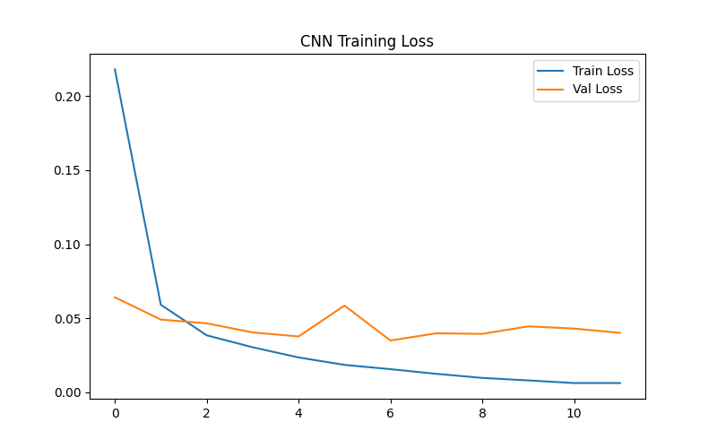
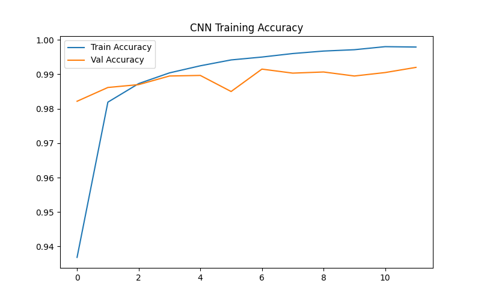
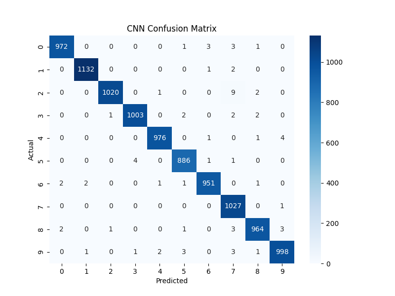

# Handwritten Digit Classification — MLP (NumPy) & CNN (Keras) on MNIST


This project implements **handwritten digit classification** on the **MNIST dataset** using two different approaches:

- 🧠 **MLP from Scratch — NumPy Only**  
- 🔥 **CNN using TensorFlow/Keras**

The goal is to compare a manually-implemented neural network against a deep-learning CNN.

---

## 📁 Project Structure

```
├── mlp_scratch.ipynb            # MLP implementation from scratch
├── mlp_weights.npz              # Saved MLP weights
├── mlp_loss.png                 # MLP Training Loss curve
├── mlp_accuracy.png             # MLP Training Accuracy curve

├── cnn_implementation.ipynb     # CNN Model using Keras
├── cnn_model.h5                 # Saved CNN model
├── cnn_loss.png                 # CNN Loss (train/val)
├── cnn_accuracy.png             # CNN Accuracy (train/val)
├── cnn_confusion_matrix.png     # CNN Confusion Matrix

└── README.md                    # Project documentation
```

---

# ⭐ Model Comparison Summary

| Metric | MLP (NumPy From Scratch) | CNN (Keras) |
|--------|---------------------------|-------------|
| **Final Training Accuracy** | **97.30%** | **99.83%** |
| **Test Accuracy** | **96%** | **99.29%** |
| **Loss Function** | Cross-Entropy | Categorical Cross-Entropy |
| **Backprop Implementation** | Manual | Automatic (Gradient Descent) |
| **Confusion Matrix** | Good but some confusion between 3, 5, 8 | Near-perfect diagonal |

---

# 🧠 Part A — MLP From Scratch (NumPy Only)

### ✔ Features
- Fully manual implementation  
- Forward pass + backward pass  
- Softmax + cross-entropy  
- Manual parameter updates  
- Saved weights in **`.npz`**  

---

## 🔢 MLP Training Results

### **Training Logs (20 Epochs)**  
```
Epoch 1/20 | Loss=0.0708 | Acc=88.66%
Epoch 2/20 | Loss=0.0250 | Acc=90.98%
Epoch 3/20 | Loss=0.0234 | Acc=92.03%
Epoch 4/20 | Loss=0.0125 | Acc=92.83%
Epoch 5/20 | Loss=0.0158 | Acc=93.38%
...
Epoch 20/20 | Loss=0.0061 | Acc=97.30%
```

---

## 📈 MLP Loss Curve  


## 📈 MLP Accuracy Curve  


---

## 📊 MLP Classification Report

```
Accuracy: 96%

              precision    recall  f1-score   support
0               0.98        0.98      0.98      1343
1               0.97        0.98      0.98      1600
2               0.96        0.96      0.96      1380
3               0.95        0.96      0.95      1433
4               0.95        0.96      0.96      1295
5               0.97        0.96      0.96      1273
6               0.97        0.98      0.98      1396
7               0.97        0.97      0.97      1503
8               0.96        0.94      0.95      1357
9               0.95        0.95      0.95      1420
```

---

# 🔥 Part B — CNN Using TensorFlow/Keras

### ✔ Architecture
- Conv2D (32 filters) + MaxPool  
- Conv2D (64 filters) + MaxPool  
- Flatten  
- Dense 128  
- Dense 10 (Softmax)  

---

## 📈 CNN Training Loss  


## 📈 CNN Training Accuracy  


---

# 📊 CNN Classification Report

**Test Accuracy: 0.9929 (99.29%)**

```
              precision    recall  f1-score   support
0               1.00        0.99      0.99       980
1               1.00        1.00      1.00      1135
2               1.00        0.99      0.99      1032
3               1.00        0.99      0.99      1010
4               1.00        0.99      0.99       982
5               0.99        0.99      0.99       892
6               0.99        0.99      0.99       958
7               0.98        1.00      0.99      1028
8               0.99        0.99      0.99       974
9               0.99        0.99      0.99      1009
```

---

## 🔷 CNN Confusion Matrix  


---

# 🏁 Final Notes

- MLP (from scratch) performs extremely well considering **no ML frameworks** are used.  
- CNN significantly outperforms it, reaching **near-perfect accuracy**.  
- The project demonstrates the difference between **manual neural networks** and **modern deep learning**.

---
